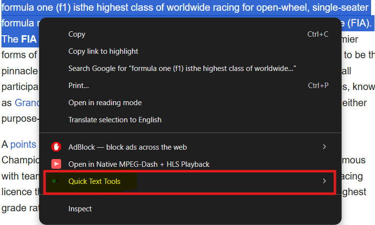
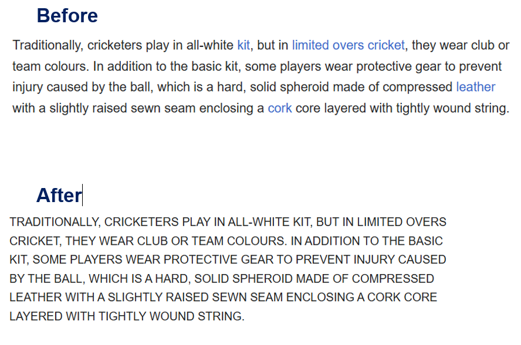
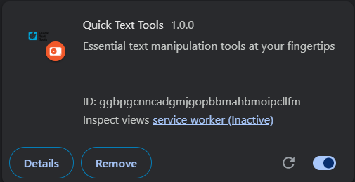

# Quick Text Tools - Chrome Extension

Essential text manipulation tools at your fingertips!

## Features
- Convert text to UPPERCASE, lowercase, or Title Case
- Count words and characters instantly
- Copy text as plain text (no formatting)
- Works on any website

## Installation
1. Download or clone this repository
2. Open Chrome and go to `chrome://extensions/`
3. Enable "Developer mode"
4. Click "Load unpacked" and select this folder
5. Done! Right-click any selected text to use

## Usage
1. Select any text on any webpage
2. Right-click
3. Choose a Quick Text Tools option
4. Magic happens! ✨

## Built With
- Manifest V3
- Vanilla JavaScript
- No external dependencies

## 📸 Screenshots

### Right-Click Menu

### Extension Working

### Installed in Chrome
